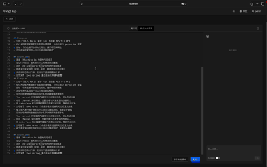

# Prompt Hub

<p align="center">Prompt Hub is a prompt management center focused on prompt authoring, versioning, and distribution.</p>

<p align="center">
  
  
</p>

<p align="center">
  
</p>

<p align="center">
  <a href="#overview">Overview</a>
  · <a href="#features--status">Features</a>
  · <a href="#tech-stack">Tech Stack</a>
  · <a href="#getting-started">Getting Started</a>
</p>

<p align="center">
  English | <a href="README-CN.md">简体中文</a>
</p>

## Overview

Prompt Hub helps teams build, iterate, and distribute prompts with the same discipline used for software configuration:

- AI-assisted editing to rewrite, complete, and optimize prompts for quality and reuse
- Nacos-like configuration center to centralize distribution and enable on-demand loading
- Versioned lifecycle (draft / published / archived) for controlled release, rollback, and auditability
- Progressive disclosure via namespaces and lazy loading to expose only task-relevant prompts

## Features & Status

- AI-assisted prompt editing
- Prompt versioning (draft / published / archived)
- Configuration center with on-demand loading
- Namespace isolation for skill prompt collections

## Tech Stack

- Backend: Go 1.24+, Gin, GORM, Wire, MySQL, Swagger
- Frontend: React 19, TypeScript, Vite, Ant Design, Zustand


## Getting Started

### Backend

1. Configure the database connection in `internal/config/setting.go`
2. Start the service:

```bash
go run cmd/app/main.go
```

Default: `http://localhost:8088`

### Frontend

```bash
cd frontend
npm install
npm run dev
```

Default: `http://localhost:3000`

### Default Account

- Username: `admin`
- Password: `adminadmin`

